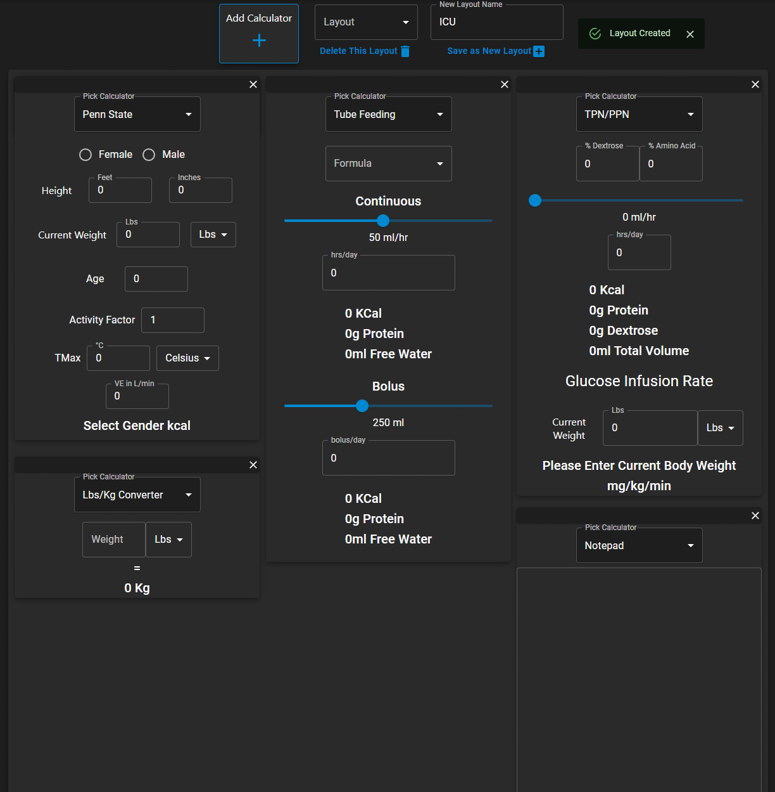
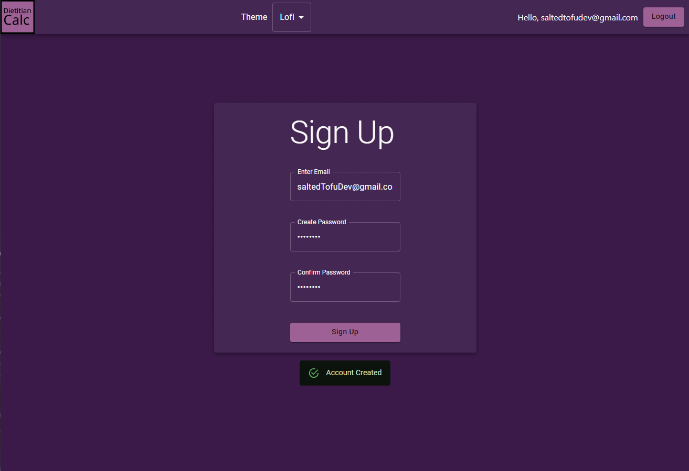

# **Dietitian Calc**
### React App created for Dietitians to perform daily calculations.
[Link to Webpage](https://rdcalc-production.web.app/)
## Table of Contents
  - [Introduction](#introduction)
  - [Technologies](#technologies)
  - [Features](#features)
  - [Screenshots](#screenshots)
  - [Room for Improvement](#room-for-improvement)
  - [Contact](#contact)
## Introduction

Dietitian Calc is a website designed for use by Clinical Dietitians to perform calculations for tube feedings, nutrition needs (kcal/protein), parenteral nutrition, etc,. The app features an area where the user can add and remove whichever calculators they need. They can drag the calculators around and position in them however they want. The user can also save their calculator layout and switch to other saved layouts with ease. 

## Technologies
 - React.js
 - Redux
 - Firebase
 - Material UI
## Features
- Utilizes React.js (create-react-app) functional components with hooks.
- Redux is used for global state management.
- Firebase used for user authentication and database storage of calculator layouts.
- React-Grid-Layout used for creating the draggable calculators.
## Screenshots
 - Calculator Layout with Dark Theme

 - Sign Up with lofi theme

## Room for Improvement
- More calculators (Tube feed modulars, Tube feed water flush, PN Lipids)
- Additional themes
- React Native App
## Contact
- Tdansby7@gmail.com
- [LinkedIn](https://www.linkedin.com/in/tyler-dansby-rd-39541916b)